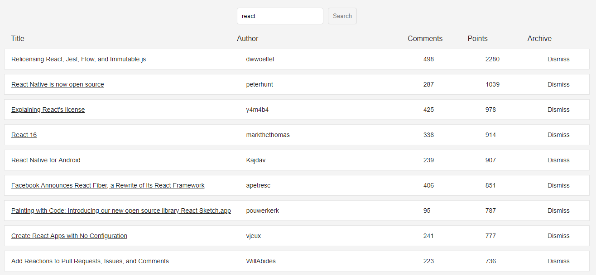
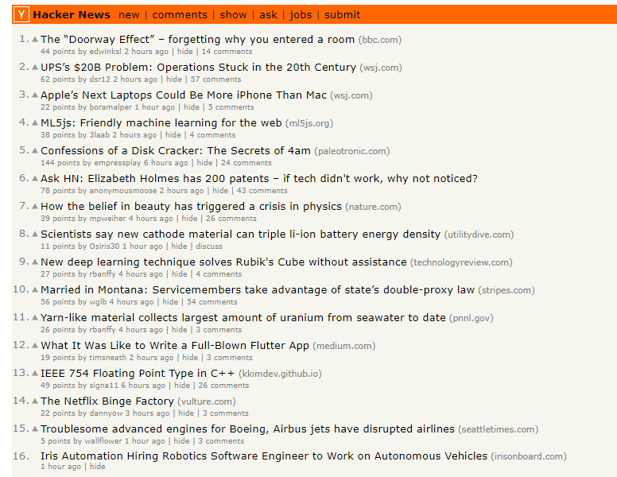

# Hacker Newz

A React application that uses the HackerNews API to retrieve computer science and technology-related articles from the [Hacker News site](https://news.ycombinator.com/).

This project was bootstrapped with [Create React App](https://github.com/facebookincubator/create-react-app).

You can find the most recent version of this guide [here](https://github.com/facebookincubator/create-react-app/blob/master/packages/react-scripts/template/README.md).

## Table of contents

* [Live](#live)
* [Screenshots](#screenshots)
* [About this project](#about-this-project)
* [Getting started](#getting-started)
* [Running tests](#tests)
* [Deployment](#react-deployment)
* [Technologies used to create app](#technologies-used)
* [Direction for future development](#future)
* [Issues](#Issues)

## Live

<https://hacker-newz.herokuapp.com/>

##  Screenshots

### App home page

### Hacker News site (https://news.ycombinator.com/)

##  About this project

* [How the app works](#how-app-works)
* [How the app is built](#how-the-app-is-built)

###  How the app works

When you navigate to the app home page, the app will automatically load articles from the [Hacker News site](https://news.ycombinator.com/). Specifically, the app is set up to load articles about Redux by default. However, if you wanted to see articles for a different topic (for example, React), just enter the topic in the <b>Search</b> box at the top of the page and click <b>Search</b>. 

The app displays the title, author, number of comments, and number of points for each article. If you want to actually read a article, simply click the title of the article. The article title is an external link, which takes you away from the app and to the site where the article is located. After you read an article, you can click <b>Dismiss</b>, which removes that article from the page.

If you run out of articles to read on a certain topic or don't see what you are looking for, click <b>Load More Articles</b> at the bottom of the page to get access to even more articles!

And, that's pretty much it. It's pretty simple to use, and it was fun to create. I plan to add more cool, interesting features to the app soon. So, stay tuned...

###  How the app is built

This project was built using React, which is an open-source Javascript library developed at Facebook specifically for the task of developing user interfaces. React relies on a component-based architecture where elements of the user interface are broken into self-contained components.

For a high level overview of React, check out this video: <https://www.youtube.com/watch?v=x7cQ3mrcKaY>.

The React documentation is available at <https://reactjs.org/>.

For more information on how this project is structured and broken into various components, see [Structure of the project](#structure-of-project).

The app also uses the HackerNews API to retrieve computer science and tech-related articles from the [Hacker News site](https://news.ycombinator.com/)  For more information about this API, see the [HackerNews API documentation](https://github.com/HackerNews/API).

##  Getting started

The following section will take you through the steps of setting up this application and getting it running locally on your computer.

If you don't want to set up this project locally and just want to see the deployed application, go to <https://hacker-newz.herokuapp.com/>.

To set up this application locally on your computer, perform the following steps:

1. [Clone the repository](#clone-repository)

2. [Install Node.js](#install-node)

3. [Install yarn](#install-yarn)

4. [Install the dependencies](#dependencies)

5. [Start the React development server](#start-server)

###  1. Clone the repository

The first step is to clone the project repository to a local directory on your computer. To clone the repository, run the following commands:
<pre>
  git clone https://github.com/philipstubbs13/hackernews.git
  cd hackernews
</pre>

####  Structure of the project

After you clone the repository, navigate to the project root directory (hackernews). The project directory structure is set up as follows:

* <b>node_modules</b>: This folder contains the project dependencies. It is ignored by git when committed to GitHub and Heroku. You install the project dependencies by running <b>yarn install</b> from the project root directory. For more information about installing dependencies for this project, go to [Install the dependencies](#dependencies).
* <b>public</b>: The public folder contains the index.html file. This HTML file is a template. The file is empty. So, if you open it directly in a browser, you will get an empty page. Rather than placing the HTML code directly in index.html, this app uses a React component-based architecture to create, build, and render UI components to the page. This folder also contains the favicon that is displayed on the browser tab.
* <b>readme_images</b>: Contains the screenshots that are used in the project README file.
* <b>src</b>: The src folder is where the React app components reside.
    * <b>index.js</b>: The index.js file is the top level file of the React app. In index.js, the App.js file is imported, and the ReactDOM.render method is used to render App.js to the page.
    * <b>App.js</b>: The App.js file is where the React components are defined and rendered and where the routes are set up. This file also contains the axios request to grab Hacker News articles from the Hacker News site using the HackerNews API.
    * <b>App.css</b> and <b>index.css</b>: The external css stylesheets for the app.
    * <b>App.test.js</b>: Contains snapshot tests.
* <b>package.json</b>: Lists the project dependencies and their version numbers. It also contains various scripts to start the server, create a production build, and run tests.
* <b>yarn.lock</b>: Dependency tree for the project. Lists all the dependencies and their versions.
* <b>.gitignore</b>: Anything listed inside this file (for example, node_modules) will not be tracked by GitHub or Heroku when code is committed.

###  2. Install Node.js

If you don't already have Node.js installed on your computer, you can install the latest version here: https://nodejs.org/en/.

###  3. Install yarn

To be able to install the dependencies and start the application locally, you will need to install yarn. Yarn is a package manager like npm.

To install yarn, run the following command:
<pre>
  npm install -g yarn
</pre>

For more information about yarn and other installation options, see the yarn documentation: <https://yarnpkg.com/en/>.

###  4. Install the dependencies

The following packages are dependencies to the project.

<ul>
  <li><b>axios</b> - a promise based HTTP client for the browser and node.js (https://www.npmjs.com/package/axios)</li>
  <li><b>classnames</b> - A JavaScript utility for conditionally joining classNames together. (https://www.npmjs.com/package/classnames)</li>
  <li><b>lodash</b> - A JavaScript utility library (https://www.npmjs.com/package/lodash)</li>
  <li><b>prop-types</b> - Used to document the intended types of properties passed to components. React checks props passed to components against those definitions, and warn in development if they don’t match.(https://www.npmjs.com/package/prop-types)</li>
  <li><b>react</b> - package for accessing React (https://www.npmjs.com/package/react)</li>
  <li><b>react-dom</b> - serves as the entry point of the DOM-related rendering paths (https://www.npmjs.com/package/react-dom).</li>
  <li><b>react-scripts</b>: package that includes scripts and configuration used by Create React App. (https://www.npmjs.com/package/react-scripts)</li>
  <li><b>react-test-renderer</b> -  this package makes it easy to grab a snapshot of the "DOM tree" rendered by a React DOM component without using a browser or jsdom. (https://www.npmjs.com/package/react-test-renderer)</li>
</ul>

In addition, the following packages are development dependencies. Enzyme is a JavaScript testing utility for React that makes it easier to assert, manipulate, and traverse React Components' output.

<ul>
    <li><b>enzyme</b></li>
    <li><b>enzyme-adapter-react-16</b></li>
    <li><b>react-addons-test-utils</b></li>
</ul>

Version information for each of these packages is available in the <b>package.json</b> file in the project root directory.

After you clone the repository to a local directory, change directory to the project root directory and run the following command to install the required packages:

<pre>yarn install</pre>

### <a name="start-server"> 5. Start the React development server.</a>

After performing all of the setup steps in the <b>Getting started</b> section, navigate to the project root directory (hackernews) and run the following command to start the React development server:

<pre>
yarn start
</pre>

After the development server has started, a Chrome browser window should open, and you should see the application. If the browser does not automatically open after the server starts, you can verify that the application is working locally on your computer by manually opening Chrome and going to <a href="http://localhost:3000">http://localhost:3000</a>.

<b>Tip</b>: If you are still unable to see the application in the browser at <a href="http://localhost:3000">http://localhost:3000</a>, ensure that no other applications/processes are using port 3000. If port 3000 is in use by another process, kill that process and then restart the server.

##  Running tests

Testing keeps the quality of code high and provides assurance that everything works. The tests for this project are located in the <b>src/App.test.js</b> file.

To run the tests, run the following command from the project root directory (hackernews):
<pre>npm test</pre>

In the <b>src/App.test.js</b> file, you will find two types of React component tests.

* [Snapshot tests with Jest](#snapshot-tests)
* [Unit tests with Enzyme](#unit-tests)

###  Snapshot tests with Jest

The first type of tests are snapshot tests. Snapshot tests use Jest, which is a JavaScript testing framework that is used at Facebook. create-react-app already comes with Jest, so no need to worry about setting it up. 

These types of tests make a snapshot of the rendered component and run this snapshot against future snapshots. When a future snapshot changes, you will get notified in the test. You can either accept the snapshot change or deny the change.

Snapshot tests ensure that the component doesn't change its output. Once it changes the output, you have to decide if you accept the changes.

Read more about testing React apps with Jest [here](https://facebook.github.io/jest/docs/en/tutorial-react.html).

###  Unit tests with Enzyme

The second type of tests are unit tests with Enzyme. Enzyme is a testing utility by Airbnb to assert, manipulate, and traverse React components. It is used to conduct unit tests to complement snapshot tests in React.

Read more about Enzyme [here](https://github.com/airbnb/enzyme).

##  Deployment

This app is deployed to Heroku. If you would like to deploy to heroku, see [Deploying React with Zero Configuration](https://blog.heroku.com/deploying-react-with-zero-configuration).

If you run into any issues with deploying the app to Heroku, run the following command in the project root directory to see the Heroku logs.

<pre>heroku logs</pre>

##  Technologies used to build app

* HTML
* CSS
* Javascript
* React (<https://reactjs.org/>)
* Node.js (<https://nodejs.org/en/>)
* HackerNews API (<https://github.com/HackerNews/API>)

##  Direction for future development
Source code will be developed over time to handle bug fixes and new features.

The following is a list of potential enhancements for future code development.

* Add feature to save articles to a MongoDB database.

* Add second page to the app that allows users to see saved articles.

* Add feature that allows users to leave comments on saved articles.

* Update css/styling  of app.

* Modularize React components into separate files for future reuse and better code readability.

* Add ESLint to help clean up code.

##  Issues

If you find an issue while using the app or have a request, <a href="https://github.com/philipstubbs13/hackernews/issues/" target="_blank">log the issue or request here</a>. These issues will be addressed in a future code update.
